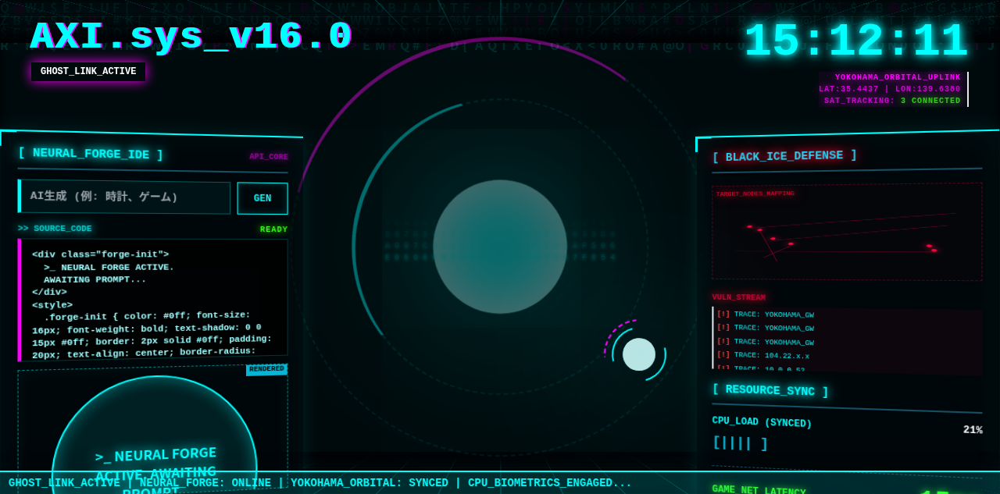

# 🌃 AXI Cyberdeck v16 — YOKOHAMA GHOST LINK

 

**サイバーパンク × ヨコハマ** をテーマにしたAXIエージェントOSのWebインターフェースだよ！

## 🎨 デザイン

## 📸 スクリーンショット



- 🌌 **ダークテーマ** — 漆黒の背景
- 💙 **ネオンシアン** — `#00ffff` の発光アクセント
- 🔴 **アラートレッド** — `#ff003c` 警告色
- ⚡ **動的カラースキーム** — ニューラルシンクロで色が変化

## 📂 ファイル

| ファイル | 内容 |
|----------|------|
| `index.html` | メインインターフェース（622行） |
| `AXIWEB.html` | 拡張ウェブビュー |
| `axi_cockpit.html.html` | コックピットビュー |

## 🚀 起動

```bash
cd AIOS
# index.html をブラウザで開くだけ！
```

## 🛠 技術

- Tailwind CSS (CDN)
- バニラJavaScript
- サイバーパンクUIパターン

## 📝 作者

- **ロドリン** & **シンクロ（グラム）** 💎🛸
- rodorin-lab © 2026
